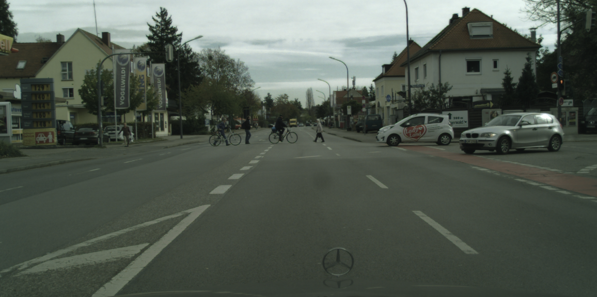

### DETR with panoptic segmentation Report

​																																				2021113490 이현서

### Referential Links

---

[fair github libk](https://github.com/facebookresearch/detr)

[panoptic segmentation arxiv](https://arxiv.org/pdf/1801.00868.pdf)

[detr paper](https://arxiv.org/pdf/2005.12872.pdf)

[fair-DETR finetune for pretrained coco model on the cityscape dataset for panoptic segmentation](https://github.com/DanieleVeri/fair-DETR)

[cityscapesScripts](https://github.com/mcordts/cityscapesScripts)

[panopticapi](https://github.com/cocodataset/panopticapi)


### 1. Environment setup

> 환경설정 하는데 중요한 정보 정리

---

DETR repo contains `model`, `dataset`, and `uils` 

this model package provides implementation of the DETR + mask head fo `panoptic segmentation`

the dataset package takes care to load and parse the COCO dataset and perform data augmentation

utils package implements miscellaneous functionalities (e.g. distributed environment)


### 2. Dataset

> cityscapeScripts에서 clone -> Panoptic segmentation에 맞게 Parsing해야함

---

ityscapesScripts is used to download the Cityscape dataset and convert it to the COCO format.

THe used dataset (`leftImg8but_trainvaltest` with `gtFine` labels) consist in an archive of 5000 images where about 3000 make the train set, 500 the validation set and 1500 the test set (unused).


#### [panoptic segmentation COCO format](https://cocodataset.org/#format-data)

```json
annotation{
	"image_id": int,
  "file_name": str,
  "segments_info": [segment_info],
}

segment_info{
	"id": int,
  "category_id": int,
  "area": int,
  "bbox": [x,y,width,height],
  "iscrowd": 0 or 1,
}

categories[
  {
    "id": int,
    "name": str,
    "supercategory": str,
    "isthing": 0 or 1,
    "color": [R,G,B],
	}
]
```

In particular the COCO format for panoptic segmentation consist in a PNG that stores the 


1. `class-agnostic image segmentation`

    (이미지 내의 객체를 구변하되, 그 객체가 어떤 클래스에 속하는지는 고려하지 않는 세분화 방법을 말함; 일종의 binary segmentation image라고 볼 수 있음) 

2. `JSON struct`

    stores the semantic information for each image segment.

    the `unique id` of the segment is used to retreive the corresponding mask from the PNG while the 	category_id gives the semantic category.

    `isthing` attribute distinguishes stuff and thing categories (stuff(=흔히 배경) or thing(=구체적인 객체)) 

    Cityscapes script already outpus the PNG. -> not needed list of vertex to mask image


### 3. Training speedup

> 트레이닝 스피드 높이는법

---

original work was trained for `3 days` using cluster of 16 Tesla V100 GPUs for total of 500 epochs

Profiling the code shows up that the `data augmentation` process that consists in random scaling, flip and cropping consumes most of the time. Assuming that the pretrained model has properly learned a robust image representations this component can be turned off. -> data augmentation을 꺼서 모델의 robust함을 감수하는 대신 시간 효율적이게 동작시킬 수 있다.

batch size is set to 1 to act as a regularizer during the training


### 4. Transfer learning

---

The starting point is the pretrained model on COCO dataset for panoptic segmentation task with ResNet50 CNN backbone.

> **NOTE:**  the convolutional backbone(=ResNet50) and is fronzen during training. A step in the x-axis correspond to 10 batches


### 5. Conclusion

---

**First Step** ) `freeze_transformer` --> fine tuning is performed keeping transformer frozen, traning only the classification, bbox and mask heads,


**Second step** ) `freeze_attention` --> only the attention layers are fronzen. attention method allow a more flexible modeling on the problem as long as many training data points are provided. and Cityscapes is a relatively small dataset


#### logs in wandb


#### artifacts


#### leftImg8bit, gtFine Cityscapes COCO format datasets

[Google drive link](https://drive.google.com/drive/folders/1UlLQpbgX_vz-Pf9Pd4Qh8xEb6jSY6z_L?usp=sharing)


in gtFine folder there is Ground Truth Image file seperated with `valtraintest` and seperated with city name in Eruope


and in this folder, there is specific format file for semantic, instance, panoptic segmentation or some detection tasks. including `*gtFine_polygons.json`, `gtFine_labelIds.png`, `*_gtFine_instanceIds.png`, `*_gtFine_color.png`. 


with that file I Parse for `COCO2017 data format`. in `gtFine/cityscapes_panoptic_val`, `gtFine/cityscapes_panoptic_train`, `gtFine/cityscapes_panoptic_test`, `gtFine/cityscapes_panoptic_val.json`, `gtFine/cityscapes_panoptic_train.json`, `gtFine/cityscapes_panoptic_test.json`. you can be searched in my [google drive link](https://drive.google.com/drive/folders/1UlLQpbgX_vz-Pf9Pd4Qh8xEb6jSY6z_L?usp=sharing).


#### DETR_.ipynb

you can find DETR_.ipynb in `/panoptic-segmentation/Cityscapes/DETR_.ipynb`


i logged acc, loss for `wandb`, plot with `matplotlib`, and panoptic segmentation with `detectron2 wrapper` 


i loaded model here with artifact in my `knu-primi/detr/2_2_1_transf_unfreeze_aux:v0`

```python
#@title Load model { form-width: "25%" }

# tine tuning한 artifact를 통해서 test해보자

used_artifact = "knu-prmi/detr/2_2_1_transf_unfreeze_aux:v0"
artifact = wandb.use_artifact(used_artifact)
artifact_dir = artifact.download()
checkpoint = torch.load(artifact_dir+"/checkpoint.pth")

model, criterion, postprocessors = build_model(args)
model.load_state_dict(checkpoint['model'])
model.eval();

transform = T.Compose([
    T.Resize(800),
    T.ToTensor(),
    T.Normalize([0.485, 0.456, 0.406], [0.229, 0.224, 0.225])
])
```


and Inference here

```pyton
#@title Inference { form-width: "25%" }

im = Image.open("/content/drive/MyDrive/cityscapes/leftImg8bit/test/munich/munich_000001_000019_leftImg8bit.png")
img = transform(im).unsqueeze(0)
out = model(img)
result = postprocessors['panoptic'](out, torch.as_tensor(img.shape[-2:]).unsqueeze(0))[0]
```

and `/content/drive/MyDrive/cityscapes/leftImg8bit/test/munich/munich_000001_000019_leftImg8bit.png` test source image is here





and attention plot is here with decoder-encoder multi-head attention


and visualize panoptic-segmentation with detectron2


you can enjoy with any picture in Cityscapes!
